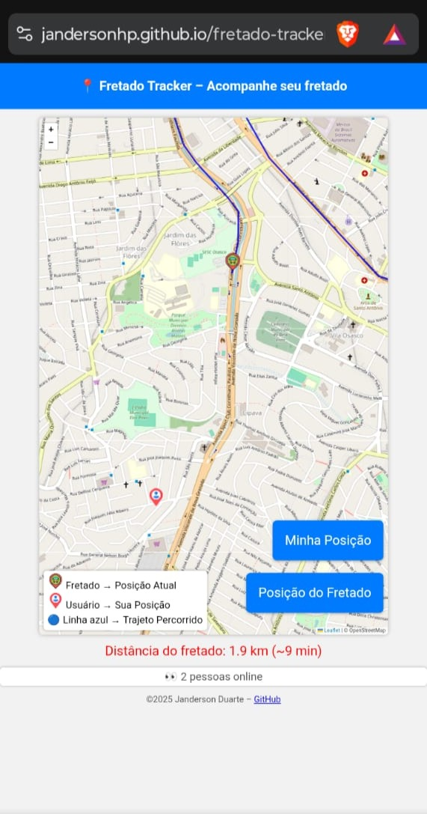

# 🚌 Fretado Tracker

 
 

> Projeto de rastreamento em tempo real de ônibus fretado, utilizando **HTML, CSS, JavaScript, Leaflet e Firebase Realtime Database**.  
> Atualização de localização controlada apenas pelo admin.

---

## 🔹 Funcionalidades

- 📍 Mostra a localização do fretado e do usuário em **tempo real** no mapa.
- 🚦 Iniciar/Parar rastreamento pelo admin.  
- 🚌 Ícone personalizado do ônibus e **trilha azul** indicando percurso percorrido.
- 📐 Mede distância / estimativa de tempo para a chegada do fretado.

---

## 🛠 Tecnologias usadas

- **HTML / CSS / JavaScript** – frontend simples e responsivo  
- **[Leaflet](https://leafletjs.com/)** – visualização do mapa e marcador do ônibus  
- **[Firebase Realtime Database](https://firebase.google.com/docs/database)** – armazenamento e atualização da localização  

---

## 🚀 Demo / Deploy

Você pode acessar o site funcionando aqui:  
[🌐 Fretado Tracker Online](https://jandersonhp.github.io/fretado-tracker/)

---

## 🌟 Futuras melhorias

- Criar **app mobile** para rastreamento em segundo plano.  
- Implementar **backend seguro** para tornar o projeto público no portfólio.  
- Adicionar **trajetos históricos e logs** do fretado.  
- Melhorias visuais e animações para o mapa e marcador.  

---

## 📌 Referências

- [Leaflet Documentation](https://leafletjs.com/)  
- [Firebase Realtime Database Docs](https://firebase.google.com/docs/database)  

---

## ⚖ License

Este projeto está sob a licença MIT. Clique abaixo para acessar:

